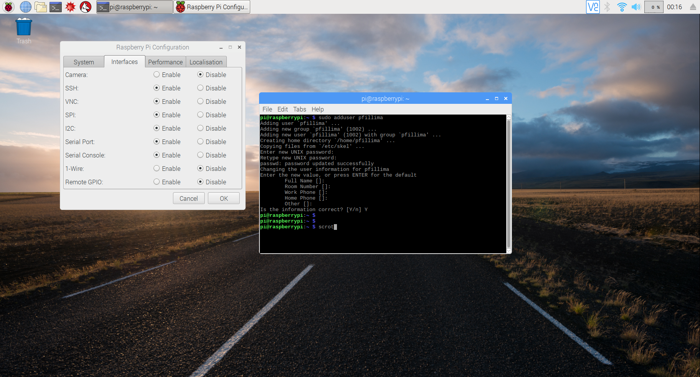
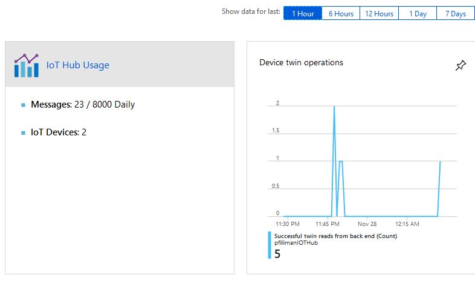

# Connecting a Raspberry Pi to the Azure IoT Hub

Microsoft Azure IoT Hub can connect a wide variety of devices and in this section we will show how to connect a Raspberry Pi to the Azure IoT. Many projects can be built using Raspberry Pi and connecting these projects to Azure IoT Hub can allow them to communicate with other devices.

# Prerequisites

First, this example is based in the following scenario:
1. Raspberry Pi 2, Model B
2. Raspbian Stretch OS on a 16 GB SD drive
3. Azure account using IoT Hub free tier
4. PuTTY installed on client machine

# Setup

## Azure IoT Hub Configuration

1. Log into the Azure Portal
2. Click the *+* button to create a new resource
3. Under *Internet of Things*, select *Iot Hub*
4. Under the *Basics* tab, give the new IoT hub a name
5. Under the *Size and Scale* tab, select the tier option desired. The F1 free tier allows for up to 8,000 messages per day, however there is only one free tier IoT hub allowed per Azure account.

## Adding the Raspberry Pi device to the IoT Hub

Once the IoT Hub has been created in steps 1 through 5 above, the Raspberry Pi can be setup

6. Within the Azure IoT Hub Azure interface, select *IoT devices* under *Explorers*
7. Select the *+ Add* button
8. Add a unique name for the Raspberry Pi device and enable the checkbox to autogenerate keys
9. Select *IoT devices* under *Explorers* and select the device just created and make note of the *connection string (primary key)*

## Configuring Raspberry Pi

10. Log into Raspbian Stretch and enable SSH and SPI if sensors are needed in the Raspberry Pi project using Raspberry Pi Configuration
11. Create a new user other than su for Raspberry Pi




{#fig:Figure 1}


``` bash

> sudo adduser <myUserName>

```

12. Add the new user create in step 11 to have same privileges as root.

``` bash

> sudo visudo

```

<myUserName>  ALL=(ALL:ALL) ALL

12. Determine the IP address of the Raspberry PI


## Configuring Raspberry Pi

Finally, we use the client to connect to RaspberryPI

13. On the client machine, open PuTTY and enter the Raspberry PI IP address.


{#fig:Figure 3}


14. When the PuTTY terminal opens, enter the userid created in step 11


{#fig:Figure 2}


We can see under the Azure IoT Hub Metrics under *Monitoring* that we have a device signal from the Raspberry Pi configured above.




{#fig:Figure 4}


